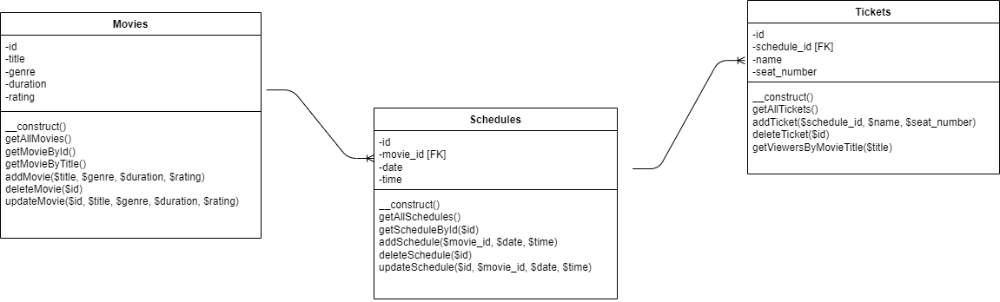
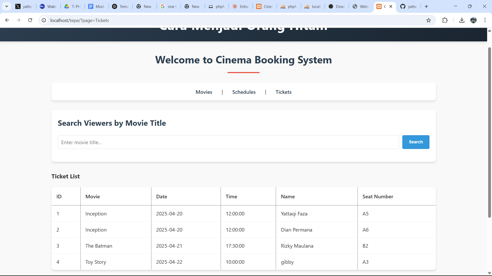
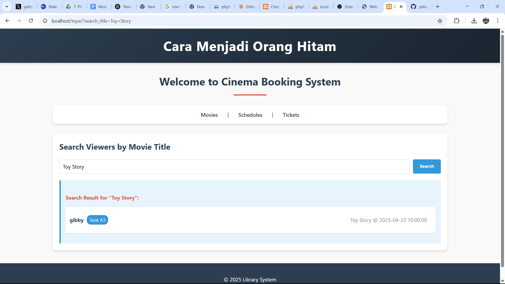
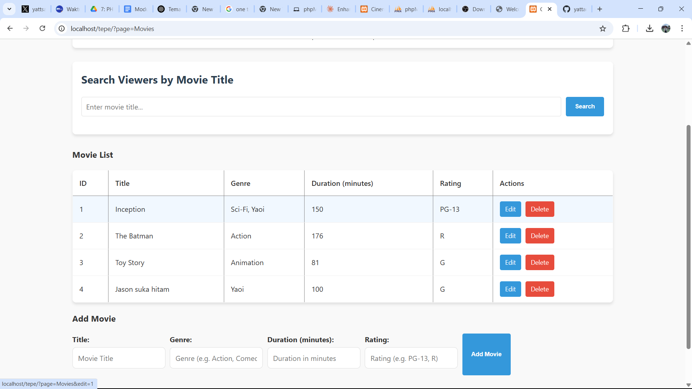
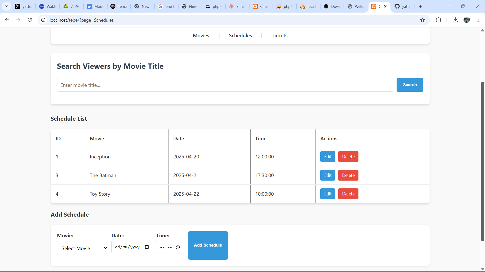
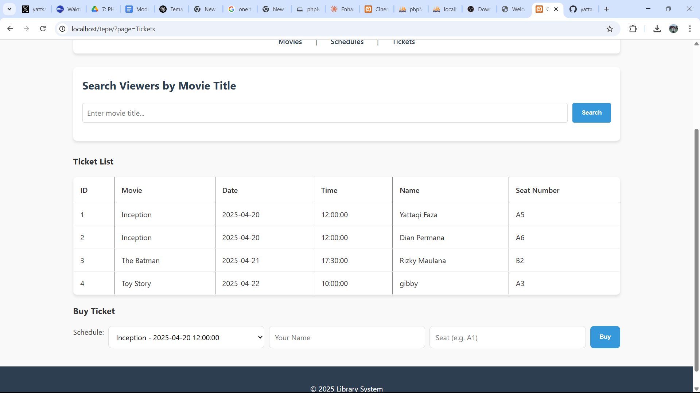

## 🎥 TP7DPBO2025C1 - Movie Booking System
Yattaqi Ahmad Faza (2311216) - C2

Aplikasi sederhana pemesanan tiket bioskop berbasis PHP Native. Sistem ini mencakup fitur CRUD untuk data film (movie), jadwal tayang (schedule), dan pemesanan tiket (ticket). Data disimpan menggunakan database MySQL dan diakses melalui PDO.

---

## 📁 Struktur Direktori

```
.
├── class/                  # Berisi file PHP untuk mengelola data (model)
│   ├── Movies.php          # Class untuk operasi terkait data film
│   ├── Schedules.php       # Class untuk operasi data jadwal tayang
│   └── Tickets.php         # Class untuk data pemesanan tiket

├── config/                 # Konfigurasi aplikasi
│   └── db.php              # File koneksi ke database (PDO)

├── database/
│   └── schema.sql          # Skrip SQL untuk membuat struktur tabel

├── view/                   # Tampilan antarmuka pengguna (UI)
│   ├── header.php          # Header halaman
│   ├── footer.php          # Footer halaman
│   ├── index.php           # Halaman utama
│   ├── Movies.php          # Tampilan daftar dan form film
│   ├── Schedules.php       # Tampilan daftar dan form jadwal tayang
│   └── Tickets.php         # Tampilan daftar dan form tiket

├── style.css               # Styling sederhana untuk UI
├── README.md               # Penjelasan desain secara notes
├── Record Penjelasan       # Penjelasan desain secara Video
├── TP                      # Penjelasan desain secara Tabel
```

---

## 🔁 Alur Program

1. **index.php** berfungsi sebagai controller utama dan menentukan tampilan berdasarkan parameter `?page=`.
2. **Koneksi database** dibuat satu kali di `config/db.php` dan digunakan oleh semua class melalui `new Database()`.
3. **Class di folder /class/** mengatur semua logika bisnis (CRUD).
4. **File di /view/** berisi elemen-elemen HTML dan form untuk interaksi pengguna.
5. Navigasi antar halaman menggunakan parameter URL seperti `?page=Movies`, `?page=Schedules`, dsb.

---

## ✨ Fitur Utama

### 🎬 Manajemen Film
- Menampilkan daftar film
- Menambahkan film baru
- Menghapus film
- (Opsional) Menyediakan update film

### 🕒 Manajemen Jadwal Tayang
- Menampilkan semua jadwal
- Menambahkan jadwal tayang berdasarkan film
- Menghapus atau memperbarui jadwal

### 🎟️ Manajemen Tiket
- Menampilkan tiket berdasarkan jadwal & film
- Menambahkan tiket
- Menghapus tiket

---

## 📷 Tampilan Antarmuka

desain tabel :


Berikut adalah contoh screenshot dari antarmuka aplikasi:

Searching :

Movie :

Schedule :

Tiket :
